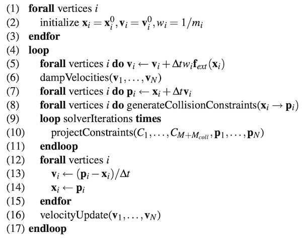
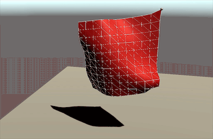
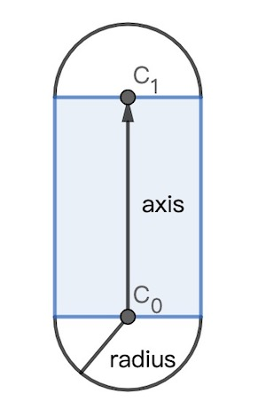
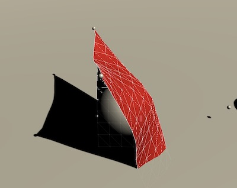
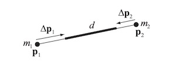
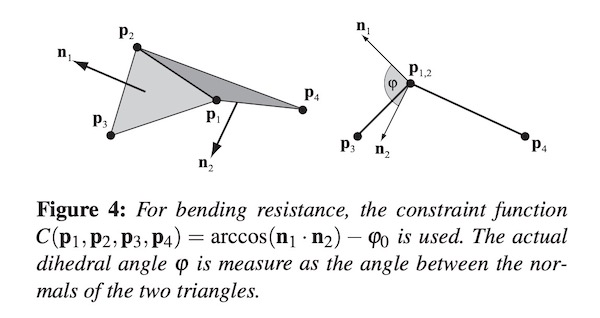
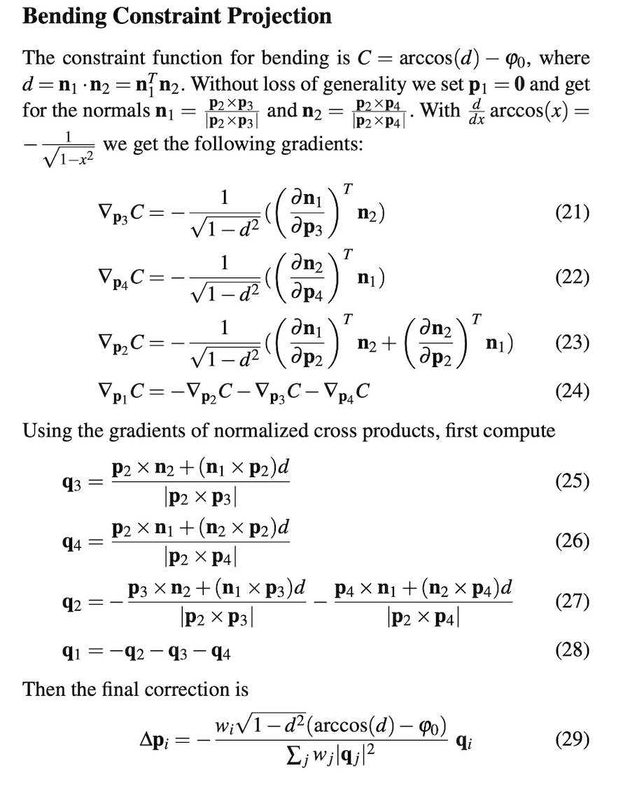
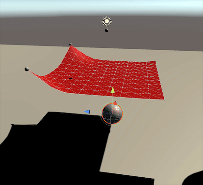

# 基于Position Based Dynamics的布料模拟

之前做过一版简单GPU布料模拟 - [GPU布料模拟入门](https://zhuanlan.zhihu.com/p/365025737)。
里面使用的方式是传统的基于力的算法，即:

- 根据位置约束计算出质点受力
- 根据受力计算出加速度
- 利用加速度迭代速度
- 利用速度迭代位置

如此往复，但这种模拟方式需要比较小的迭代步长才能保持稳定，比较耗费计算量。因此这次准备使用Position Based Dynamics算法来进行模拟， 然后使用Unity的Job System版本实现CPU并行计算。 Position Based Dynamics算法的优势在于，其可以拥有很大的迭代步长，且有优秀的稳定性。而JobSystem配合Burst编译，其运算性能也是非常强劲的。

目前实现的功能有:

- 外力
  - 重力
  - 风力
- 内部约束
  - 距离约束
  - 弯曲约束
- 碰撞约束
  - 与Sphere、Box、Capsule的碰撞
- 固定约束
  - 可以将布料固定到任意位置
- 对场景物体施加反作用力

暂未实现的功能

- 布料自碰撞
- 布料破坏
- GPU模拟版本
- 连续碰撞检测

先放个效果图吧


# 1. Position Based Dynamics简介

PBD的算法流程图如下



图中x为当前质点位置,p为预测质点位置。可以看到:

- 算法在每一帧开始时，会根据外力和阻尼先于计算一个位置(p)
- 根据当前位置(x)和预测位置(p)，去进行碰撞检测，如果发现有碰撞，就生成一个碰撞约束
- 迭代求解所有约束，最终会得到新预测位置p
- 利用p - x 来计算速度v，并将p赋值给x
- 最后再计算一遍速度(处理碰撞反弹之类速度变换)

关于外部力的定义:

像重力、风、可以视为外部力，但是像质点之间的相互作用我们通常视为内部约束，而非力。同样外部物体对质点的碰撞，也视为碰撞约束而不是外部力。

# 2. 布料模型构建

在物理上，我们通常可以将布料视作由一个个质点组成的结构。质点之间满足一定的约束条件，来模拟布料内部的作用力，如下图所示:


在传统的基于力的模拟中，质点之间的约束通常是用胡克定律以弹簧振子的形式去模拟。但是在基于位置的方案中，我们将会采用另外一种约束公式。

那么具体到实际渲染中，质点代表的是什么呢？

一种方案是，让质点代表骨骼，然后布料的Mesh顶点以权重的方式绑定到骨骼上。这种方案的优势是质点的数量和布料顶点的数量相互独立，也即物理模拟的精度和渲染的精度相互独立。但劣势在于需要手动对布料做骨骼绑定。

另一种方案是直接让质点与布料模型顶点一一对应，然后让三角形的边作为顶点之间的约束。 好处是无需额外的骨骼绑定工作，我们可以针对任意Mesh进行布料模拟(也没那么任意，还是需要满足一定的拓扑条件的)，坏处是如果模型顶点较多，将比较耗费性能。

这里作为Demo项目，将直接采用第二种方案。

想要进行布料模拟的Mesh，必须满足以下条件:

- 一条边只被两个三角形共享
- 不封闭


# 3. 数据结构

因为要使用Unity JobSystem来进行并行计算，所以我们将采用平坦的结构来保存位置、速度之类的信息。

这里我们将使用NativeList来保存所有质点的位置、速度、预测位置、质量等信息。
位置的初始信息可以直接从Mesh中读取，但质点的质量需要通过一定算法生成。

```csharp
private NativeList<float3> _vertices;
private NativeList<float3> _velocities;
private NativeList<float3> _predictPositions;
private NativeList<float> _masses;
```

另外这里还引入了`Unity.Mathematics`这个库，里面定义了很多与shader类似的数据结构，例如`float4`这种。这个数学库是Unity专门针对SIMD进行优化的。

## 3.1 质量生成算法

通常来说，我们可以给一块布指定其密度(kg/m^2)。 这样的话，我们就可以根据Mesh的面积来计算质量。具体来说就是:

- 遍历Mesh的所有三角面
- 计算每个三角面的面积，乘以密度得到质量
- 将质量三等份，分别累加给每个顶点

这样我们就得到了每个顶点的质量。

代码如下:

```c#
//var indices;
//var vertices;
//...
_masses = new NativeList<float>(this.vertexCount,Allocator.Persistent);
_masses.Resize(this.vertexCount,NativeArrayOptions.ClearMemory);
for(var i = 0; i < indices.Length / 3; i++){
    var offset = i * 3;
    var i0 = indices[offset];
    var i1 = indices[offset + 1];
    var i2 = indices[offset + 2];
    var v0 = vertices[i0];
    var v1 = vertices[i1];
    var v2 = vertices[i2];
    var area = IntersectUtil.GetArea(v0,v1,v2);
    var m = area * _setting.density;
    var m3 = m / 3;
    _masses[i0] += m3;
    _masses[i1] += m3;
    _masses[i2] += m3;
}
```

# 4. 预测位置计算

为了使用JobSystem进行并行计算，我们可以实现一个如下的结构:

```c#
struct PositionEstimateJob : IJobParallelFor
{
    [ReadOnly] 
    public NativeArray<float3> positions;
    [ReadOnly] 
    public NativeArray<float3> velocities;
    [ReadOnly]
    public NativeArray<float3> normals;
    [ReadOnly]
    public NativeArray<float> masses;
    [WriteOnly]
    public NativeArray<float3> predictPositions;
    public float3 fieldForce;
    public float damper;
    public float dt;

    public void Execute(int index)
    {
      var p = positions[index];
      var v = velocities[index];
      var m = masses[index];
      //....
    }
}
```

JobSystem将会在多线程上并发执行Execute函数，在这里将会针对每个质点执行一次Execute函数，index为当前执行的任务索引(也即质点索引)。由于在这一步每个质点只更新自己的预测位置，不存在Race Condition，因此可以进行无锁并发。

在这里，我们输入的数据有:

- positions - 位置
- velocities - 速度
- normals - 法线
- masses - 质量
- fieldForce - 外部场力,例如风力
- damper - 阻尼系数
- dt - 迭代时间

输出为:

- predictPositions

位置预测公式如下:

$$

\begin{aligned}
\vec{v_1} = \vec{v_0} + (\vec{g}  + \frac{\vec{F_{e}}}{m}) \Delta t \\
v_1 = v_1 * \max(1 - \frac{k_d}{m} \Delta t,0)\\
p_1 = p_0 + v_1 * \Delta t
\end{aligned}

$$

这三条公式，第一步为预测速度，第二步对速度施加阻尼，其中kd为阻尼系数，第三步利用速度预测位置。

g为重力加速度，$F_e$为作用于质点的外力，在本例里我们只用到了风力。 风对质点的作用力，需要投影到质点的法线方向，这也是为什么这个Job的输入需要有法线信息。

随风舞动的效果：



# 5. 碰撞计算

这里我们将实现针对球体(Sphere)、方体(Box)、胶囊(Capsule)三种基础类型的碰撞检测。为简单起见，目前将采用离散的检测方式，即判断质点是否在相关碰撞体内部。

算法流程为:

```
for position, predictPosition,index in vertices:
  for collider in colliders:
    concat = CheckCollision(position,predictPosition,collider)
    if concat:
      AddCollisionConstraint(index,concat.position,concat.normal)

```

可以看到，以上伪代码的具体思路为:

- 遍历所有质点，取其位置和预测位置，与所有的碰撞体做检测
- 如果发现进入碰撞体内部，则计算出碰撞体表面距离当前质点最近的一个点
- 对当前质点施加一个碰撞约束，让其在后面的约束迭代中强行离开碰撞体，回到表面去。

## 5.1 几种基础碰撞体的数据结构

首先是球体，这是最简单的一种碰撞体

```c#
public struct SphereDesc{
    public float3 center;
    public float radius;
}
```

然后是平行六面体:

```c#
public struct BoxDesc{
    public float3 min;
    //3个边轴,xyz为normalzied的朝向，w为长度
    public float4 ax; 
    public float4 ay;
    public float4 az;
}
```

可以看到我们使用了xyz-min的角、和3个边向量来定义这个Box，严格来说，它能描述三维空间中的任意平行六面体。其中三个边向量，我们用float4保存，并且做了一些预计算。其xyz分量为单位向量，w分量向量长度。相关的预计算可以加速后面的碰撞检测。

胶囊体:
```c#
public struct CapsuleDesc{
    public float3 c0;
    public float4 axis; //xyz为单位化的方向，w为长度
    public float radius;
}
```

Capsule我们可以将其看成两个半球 + 一个圆柱体的组合，如下图所示:



以上的结构数据均定义在世界坐标空间，关于如何判定一个点是否在这些碰撞体的内部，这里将不详细展开，不然又是很长篇。 总之，在`IntersectUtil`这个类里，我们实现了相关的函数，以球体为例

```c#
public static bool GetClosestSurfacePoint(float3 p, SphereDesc sphere, out ConcatInfo concatInfo)
```

GetClosestSurfacePoint它接收一个点p坐标，和一个碰撞体描述(这里是SphereDesc)，如果发现点在碰撞体内部，就返回true,并且输出一个ConcatInfo结构。

ConcatInfo里保存了碰撞体表面距离p最近一个点的position和normal信息。

我们的目的不仅仅是让这些碰撞体来约束布料，同时布料也要反作用于这些碰撞体(假如是RigidBody的话)。

因此这里额外定义一个刚体描述结构:

```c#
public struct RigidbodyDesc{
    public float mass;
    public float bounciness;
    public float3 velocity;
}
```

然后将RigidBody和Collider组合在一起:

```c#
public struct RigidbodyColliderDesc<T> where T:IColliderDesc{
    public int entityId;
    public T collider;
    public RigidbodyDesc rigidbody;
}
```
其中entityId后面会用来查找Unity对象。

然后定义个结构把所有需要与布料进行碰撞检测的数据整合在一起:

```c#
public struct CollidersGroup{
    private NativeList<RigidbodyColliderDesc<SphereDesc>> _spheres;
    private NativeList<RigidbodyColliderDesc<BoxDesc>> _boxes;
    private NativeList<RigidbodyColliderDesc<CapsuleDesc>> _capsules;
}
```





## 5.2 CollisionJob

接下来我们要用多线程任务并行执行碰撞检测和反作用力计算。

看一下这个Job的输入输出数据结构:

```c#

public struct CollisionJob : IJobParallelFor
{
    [ReadOnly]
    public float dt;
    [ReadOnly]
    public NativeArray<float3> positions;
    [ReadOnly]
    public NativeArray<float3> predictPositions;
    [ReadOnly]
    public NativeArray<float> masses;
    [ReadOnly]
    public CollidersGroup collidersGroup;
    [WriteOnly]
    public NativeArray<CollisionConstraintInfo> collisionConstraints;
    public NativeArray<ConstraintType> constraintTypes;
    public NativeList<RigidBodyForceApply>.ParallelWriter rigidBodyForceApplies;
}
```

它会根据当前质点的predictPosition和position信息，与CollidersGroup中的所有碰撞体进行碰撞检测，如果检测到有碰撞发生，则会做如下事情:

- 修正predictPosition，避免碰撞发生
- 将双方速度投影到接触点法线方向，利用动量守恒、动能公式重新计算双方在法线方向的速度
- 将对Collider的速度修正贡献写入到rigidBodyForceApplies中，供后续实际作用到unity rigidboy对象。
- 将对质点的约束信息写入到collisionConstraints中，供后续约束迭代阶段使用.

那么在法线方向上，碰撞引起的速度改变要怎么计算呢？ 这其实是高中的物理知识。 两个物体碰撞，要符合动量守恒定律，即: 

$m_0v_0 + m_1v_1 = m_0v_0' + m_1v_1'$。

当两个物体是完全弹性碰撞时，他们在动能上要符合以下公式(即动能守恒):

$m_0v_0^2+m_1v_1^2=m_0v_0'^2+m_1v_1'^2$

而如果是完全非弹性碰撞，则动能不守恒，但最终两个物体的速度一致，即:

$v_0' == v_1'$

那么介于这两者之间的情况，我们通常用一个弹性系数C来描述。C = 1表示完全弹性碰撞，C = 0表示完全非弹性碰撞，完全的碰撞速度计算公式如下:

$$

\begin{aligned}

v_0' = \frac{(c + 1)m_1v_1 + v_0(m_0-cm_1)}{m_0+m_1} \\
v_1' = \frac{(c + 1)m_0v_0 + v_0(m_1-cm_0)}{m_0+m_1} 
  
\end{aligned}

$$

总之，利用以上的公式，我们就成功的完成了法线方向的碰撞反馈计算。

实际上，如果两个物体表面存在摩擦力，那么在垂直于法线的另一个方向上也会产生力的相互作用。但是在当前的这个版本里，我们暂且忽略一下吧。


# 6. 内部约束

在布料模拟中，存在如下几种约束:

- 距离约束
- 弯曲约束
- 固定约束
- 碰撞约束

下面依次来说明.


## 6.1 距离约束

距离约束就是两个质点之间的距离，必须保持被约束在一定范围之内。



通常在布料初始化的时候，会记录下存在距离约束关系的质点之间的距离，称为RestLength(也即图中的d)。
在后续模拟中，当两个质点间距离小于RestLength时，我们就要将其推开，反之则要将他们拉拢。也即他们之间存在一根无形的弹簧。 

那么两个质点之间的距离约束，要符合怎样的迭代公式呢？我们要如何为p1和p2分别计算出它们的修正量delta_p1和delta_p2呢？

这里直接给出结论公式:

$$

\begin{aligned}
\Delta \vec{p_1} = - \frac{m_2}{m_1 + m_2}(|p_1 - p_2| - d) \frac{p_1 - p_2}{|p_1-p_2|} \\
\Delta \vec{p_2} = \frac{m_1}{m_1 + m_2}(|p_1 - p_2| - d) \frac{p_1 - p_2}{|p_1-p_2|} \\
\end{aligned}

$$

原论文[[1] Matthias Müller, Position Based Dynamics, 2006](https://matthias-research.github.io/pages/publications/posBasedDyn.pdf) 中给出了更一般的约束关系的公式推导，有兴趣可以看看，主要是用了牛顿-拉夫逊迭代法。


在本例中，我们会根据三角面信息，为所有存在边连接的点建立距离约束。即:

```c#
private void BuildDistConstraints(){
    var edges = _meshModifier.edges;
    foreach(var e in edges){
        this.AddDistanceConstraint(e.vIndex0,e.vIndex1);
    }
}
```

距离约束结构定义:

```c#
public struct DistanceConstraintInfo{
    public float restLength;
    public int vIndex0;
    public int vIndex1;
}
```

## 6.2 弯曲约束

弯曲约束可以用来控制相邻两个面片的对折程度，这符合现实中布料的特性。 例如当我们将一块布料对折放置在平面上，其对折处会有一段弧形隆起。这就是布料内部结构存在的抵抗弯曲的力。 下图展示了一个弯曲约束的效果:


在布料建模中，弯曲约束可以由如下一幅图定义，这里我直接拿论文中的图:



两个相邻的三角面，共4个顶点，组成一个约束公式。 

两个三角面的法线点乘，给出了三角面的夹角信息，在后续的模拟迭代中，我们只要约束这个夹角就行了。论文中同样给出了完整的计算公式推导过程，这里直接截图贴上:




细细品味吧。

弯曲约束的结构定义:

```c#
public struct BendConstraintInfo{
    public int vIndex0;
    public int vIndex1;
    public int vIndex2;
    public int vIndex3;
    public float rest; // angle
}
```

## 6.3 固定约束

顾名思义，这种约束是将某个质点固定在某个坐标上，令其无法移动。 所以这个约束的实现很简单，我们只要让这个质点位置不变，速度为0即可。


## 6.4 碰撞约束

在Part5中，我们提到了碰撞计算。但是在碰撞计算阶段并不会去直接修改质点的位置，而是生成一个碰撞约束，交由后续约束迭代阶段进行质点位置计算。

目前碰撞约束的结构很简单:

```c#
public struct CollisionConstraintInfo{
    public float3 concatPosition;
    public float3 normal;
    public float3 velocity;
}
```

在约束迭代阶段，质点会将自己的位置尽量往concatPosition去靠近。碰撞约束作为最高级约束，在其生效时，其他的约束应该不起作用。 velocity保存了碰撞计算得到的质点速度。


## 6.5 约束迭代步骤

考虑到Unity JobSystem的特性，目前实现的约束迭代流程如下:

1. Distance Constraint Job - 独立线程计算，把结果写入positionCorrect数组
2. Bend Constarint Job - 独立线程计算，依赖第一步完成，同样把结果累加到positionCorrect数组
3. Final Constraint Job - 多线程并发计算，会处理固定约束、碰撞约束，并且合并1,2两步生成的positionCorrect.

还有一种可选方案是,提供两个独立的positionCorrect数组，这样就可以让1、2步的两个线程同时开始计算。然后两个独立的positionCorrect数组最后在步骤3中合并。

纲领性代码:

```c#
private JobHandle StartConstraintsSolveJob(JobHandle depend){
   JobHandle jobHandle = depend;
   var predictPositions = this._predictPositions;
   for(var i = 0; i < this.constraintSolverIteratorCount; i ++){
       jobHandle = StartDistanceConstraintsJob(jobHandle,i);
       jobHandle = StartBendConstraintsJob(jobHandle,i);
       jobHandle = StartFinalConstraintsJob(jobHandle,i);
   }
   return jobHandle;
}
```


# 7. 更新质点位置与速度

在完成约束迭代计算之后，我们得到了一份最终版本的predictPositions。

然后我们利用以下公式完成速度和位置的更新:

```c#
velocity = (predictPosition - position)/dt
position = predictPosition
```

如果质点在之前的碰撞计算中得到了新的速度，那么这里采用碰撞计算的速度作为最新速度，即

```c#
public void Execute(int index)
{
   if( (constraintTypes[index] & ConstraintType.Collision) == ConstraintType.Collision){
       velocities[index] = this.collisionConstraintInfos[index].velocity;
   }else{
       velocities[index] = (predictPositions[index] - positions[index])/dt;
   }
   positions[index] = predictPositions[index];
}
```

这里也设计成一个多线程并发计算的Job。

# 8. 布料对场景物体施加作用力

在先前的CollisionJob阶段，我们已经完成了碰撞反馈计算，并把对场景Rigidbody的作用速度写入到了`NativeList<RigidBodyForceApply>`数组中。 

那么接下来，我们只要取得这个数组，查找到对应的Rigidbody，对其使用`AddForce()`即可:

```c#
private void ApplyPhysicalSimulationToRigidbodies(){
   for(var i = 0; i < _rigidBodyForceApplys.Length; i ++){
       var forceInfo =  _rigidBodyForceApplys[i];
       _colliderProxies[forceInfo.entityId].attachedRigidbody.AddForce(forceInfo.velocity,ForceMode.VelocityChange);
   }
}
```

以上是布料下落推动一个球体向前滚动的效果:



# 10. 暂未实现的功能探讨

## 10.1 连续性碰撞检测

在离散碰撞检测下，我们只要检测质点是否位于碰撞体内部即可，但离散检测在速度较快的情况下将会发生穿透现象。

连续性碰撞检测的出现就是为了修正这个问题。例如对于质点，我们可以将其前后两帧的位置连成一根线，然后判断这根线是否与碰撞体相交。很明显连续性碰撞检测需要的计算量是远大于离散性检测的，手写所有Collider的连续碰撞检测工作量还是较大的。。通常可以使用一些三方库来做这个事情。

## 10.2 关于布料破坏

布料破坏的原理是比较简单的。即当两个质点之间的距离超出一定阈值，那么视为被撕裂，我们就移除这两个质点之间的距离约束。

但这里稍微复杂一点的问题在于，我们需要动态去调整Mesh的拓扑结构。当布料被撕裂时，我们需要:

- 在Mesh撕裂位置新增顶点
- 调整附近三角面的顶点索引，插入新增的顶点，以起到让两个三角面分离的效果
- 更新布料的距离约束、弯曲约束关系

以上就需要我们在一开始的时候建立好布料的拓扑关系，以快速的根据顶点查询边、三角面等信息。
另一方面，如果存在动态增删布料顶点和相关约束关系的话，对数据结构的设计也是一种考验。像我们使用NativeArray这种平坦行存储结构的话，一旦遇到扩容代价都是比较大。

## 10.3 关于布料自相交

布料自相交实际上就是布料质点与自身三角面进行碰撞检测，避免穿透。这里只能使用连续性的碰撞检测，因为布料本身没有厚度，所以必须根据质点前后两帧的位置信息去判断是否穿到面的另一边。

只是简单的想了一下，整个计算过程还是消耗很大的。因为每个质点，都要与每个三角面进行连续性碰撞检测，复杂度是O(n^2)。暂未研究是否有什么方案可以加速这个计算。


## 10.4 GPU版本

因为JobSystem的设计本身就是并行计算，因此改写成GPU ComputeShader版本应该是非常方便的。相关的NativeArray都可以转成ComputeBuffer， 然后将碰撞体信息传入GPU即可。 每个并行的Job等同于ComputeShader的一次Dispatch。

但是如果布料要对场景物体施加作用力的话，这里就需要存在一个GPU数据回读到CPU的一个过程。就是上面提到的`RigidBodyForceApply`数组信息。 后面我可以再实现一个GPU版本出来。


# References

[[1] Matthias Müller, Position Based Dynamics, 2006](https://matthias-research.github.io/pages/publications/posBasedDyn.pdf)
